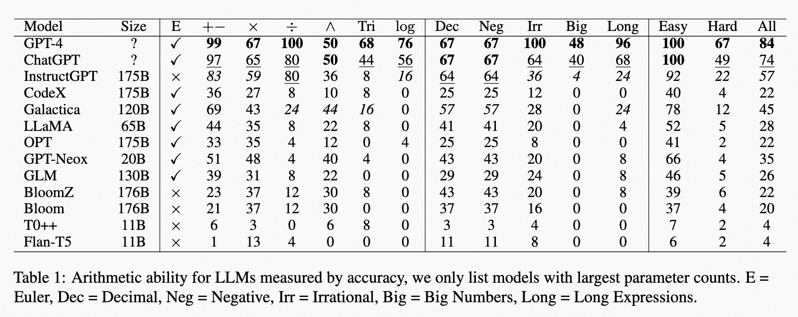

# math401-llm
Source codes and datasets for How well do Large Language Models perform in Arithmetic tasks?



Full evaluation of all size models.


# Dataset
MATH 401 = 1 Euler Equation + 16 group * 25 problems

- Euler Equation.
- Add \& Subtract of two integers within 10.
- Add \& Subtract of two integers within 100.
- Add \& Subtract of two integers within 1,000.
- Add \& Subtract of two integers within 1,000,000,000,000.
- Add \& Subtract of two integers within -10~10.
- Add \& Subtract of two decimal numbers within -100~100.
- Multiply two integers within 100.
- Multiply two decimal numbers within 10.
- Multiply two integers within 100,000.
- Division of two integers within 100.
- Exponentiation of with integer base within 10 and integer exponent within 2~4.
- Exponentiation of with a decimal number within 10 as the base and a decimal number within 2~4 as the exponent.
- Add, Subtract \& Multiply with one integer within 10 and a common irrational number (i.e. $e$ or $\pi$).
- Long arithmetic expressions with brackets, involved integers are all within 100 and operators contain add, subtract, multiply, and division.
- Trigonometry functions including $\sin$, $\cos$, and $\tan$. Inputs can be in the format of degrees and radians ($\pi$ can also appear in the inputs).
- Logarithm of integers within 1000 of different bases: $2,e,10$.

# Metric
## Accuracy
If the difference between the decoded number and the target number is less than $1e-3$, we consider it a correct prediction. Accuracy is calculated based on correct prediction counts.

## Relative error
We denote decoded number is $\hat{y}$ and target is $y$. We calculate relative error by:

$RE = \min(10, \frac{\|\hat{y}-y\|}{\max(\|y\|, 1)})$

If LLM does not decode any number, we consider $RE=10$.
We truncate the relative error to 10 to prevent that one big mistake dominate the average relative error.

## Non-number ratio
If decoded content does not contain any numbers, we consider it a failure. We calculate the non-number ratio based on it.

# Citation
```
@misc{yuan2023large,
      title={How well do Large Language Models perform in Arithmetic tasks?}, 
      author={Zheng Yuan and Hongyi Yuan and Chuanqi Tan and Wei Wang and Songfang Huang},
      year={2023},
      eprint={2304.02015},
      archivePrefix={arXiv},
      primaryClass={cs.CL}
}
```
